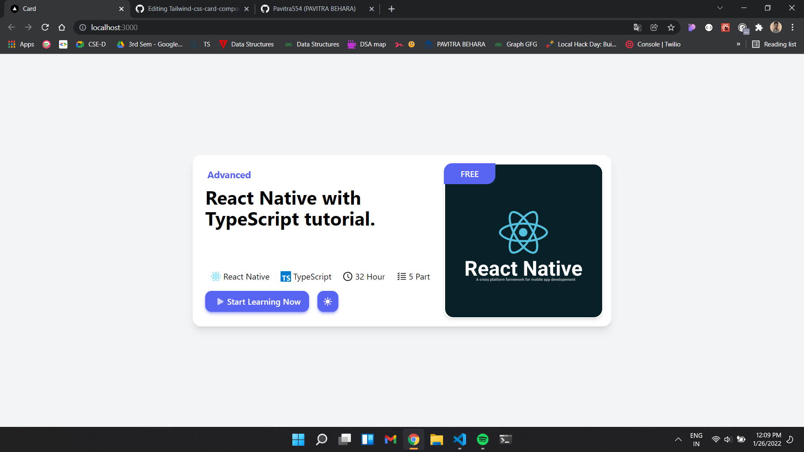
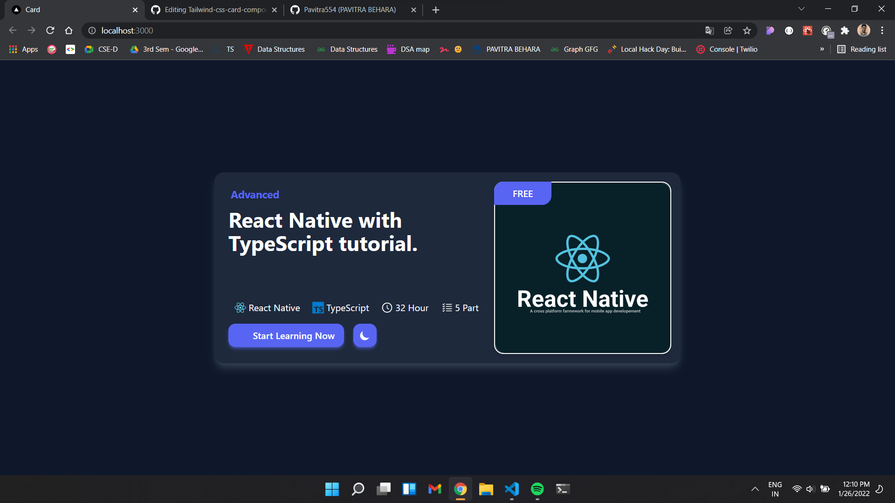
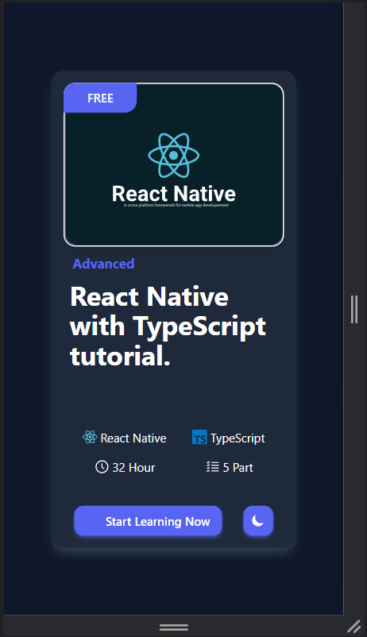
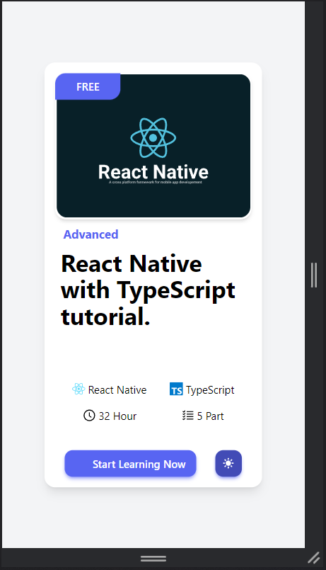

<p align="center">
  <a href="https://nextjs.org">
    
    <h1 align="center">Next.Js</h1>
  </a>
</p>

 
<p align="center">
  <a href="https://nextjs.org/">
    
  </a>
    <a aria-label="Vercel logo" href="https://reactjs.org/">
    
  </a>
    <a href="https://www.framer.com/motion/">
   
  </a>
 
  <a aria-label="Vercel logo" href="https://www.javascript.com/">
    
  </a>
  <a aria-label="NPM version" href="https://www.npmjs.com/">
    
  </a>
  
   <a aria-label="NPM version" href="https://www.w3schools.com/css/">
    
  </a>
  
</p>


# Project Name : Tailwind Card Component

This is just a card commponent using tailwind css. it just awesome.

# Technologies

- Next.Js
- React.Js
- Tailwind Css
- heroicons
- React-icons
- JavaScript 
- Visual Studio Code
- Git & GitHub <br/>

# How it look's
    
  
  
  
  

# Some important information about Next.Js
## Getting Started

First, run the development server:

```bash
npm run dev
# or
yarn dev
```

Open [http://localhost:3000](http://localhost:3000) with your browser to see the result.

You can start editing the page by modifying `pages/index.js`. The page auto-updates as you edit the file.

[API routes](https://nextjs.org/docs/api-routes/introduction) can be accessed on [http://localhost:3000/api/hello](http://localhost:3000/api/hello). This endpoint can be edited in `pages/api/hello.js`.

The `pages/api` directory is mapped to `/api/*`. Files in this directory are treated as [API routes](https://nextjs.org/docs/api-routes/introduction) instead of React pages.

## Learn More

To learn more about Next.js, take a look at the following resources:

- [Next.js Documentation](https://nextjs.org/docs) - learn about Next.js features and API.
- [Learn Next.js](https://nextjs.org/learn) - an interactive Next.js tutorial.

You can check out [the Next.js GitHub repository](https://github.com/vercel/next.js/) - your feedback and contributions are welcome!

## Some important information about Tailwind Css with Next.js 
   Step-1 First create a next app <br/>
    ```npx create-next-app my-project```<br/>
    Step-2 Go to the project directory <br/>
    ```cd my-project```<br/>
    Step-3 run the following command on terminal <br/>
    ```npm install -D tailwindcss postcss autoprefixer```<br/>
    Step-4 then run this command<br/>
    ```npx tailwindcss init -p```<br/>
    Step-5 add this in tailwind.config.js<br/>
   ```javascript
module.exports = {
  content: [
    "./pages/**/*.{js,ts,jsx,tsx}",
    "./components/**/*.{js,ts,jsx,tsx}",
  ],
  theme: {
    extend: {},
  },
  plugins: [],
}
```
Step-6 add the following code in global.css file
```css
@tailwind base;
@tailwind components;
@tailwind utilities;
```


## Deploy on Vercel

The easiest way to deploy your Next.js app is to use the [Vercel Platform](https://vercel.com/new?utm_medium=default-template&filter=next.js&utm_source=create-next-app&utm_campaign=create-next-app-readme) from the creators of Next.js.

Check out our [Next.js deployment documentation](https://nextjs.org/docs/deployment) for more details.
# Thanks for visiting🤗
